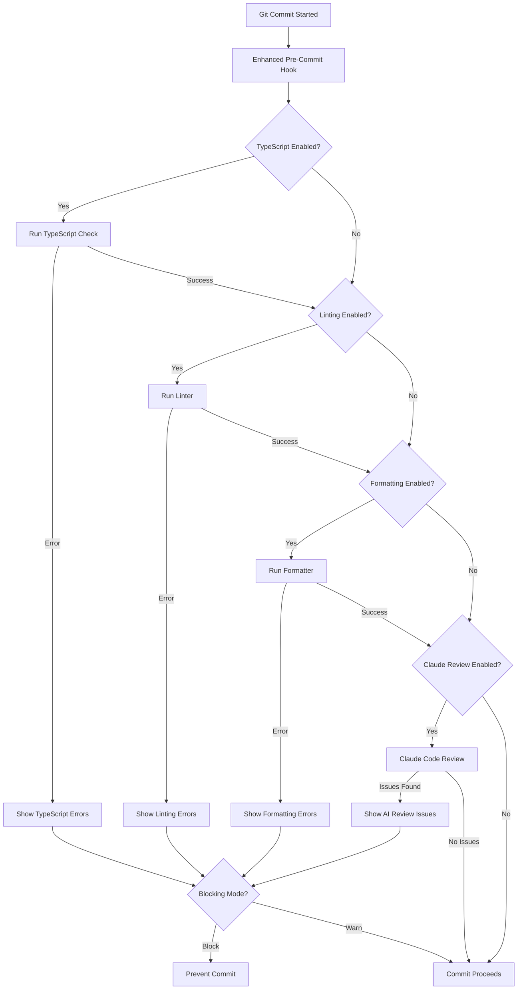
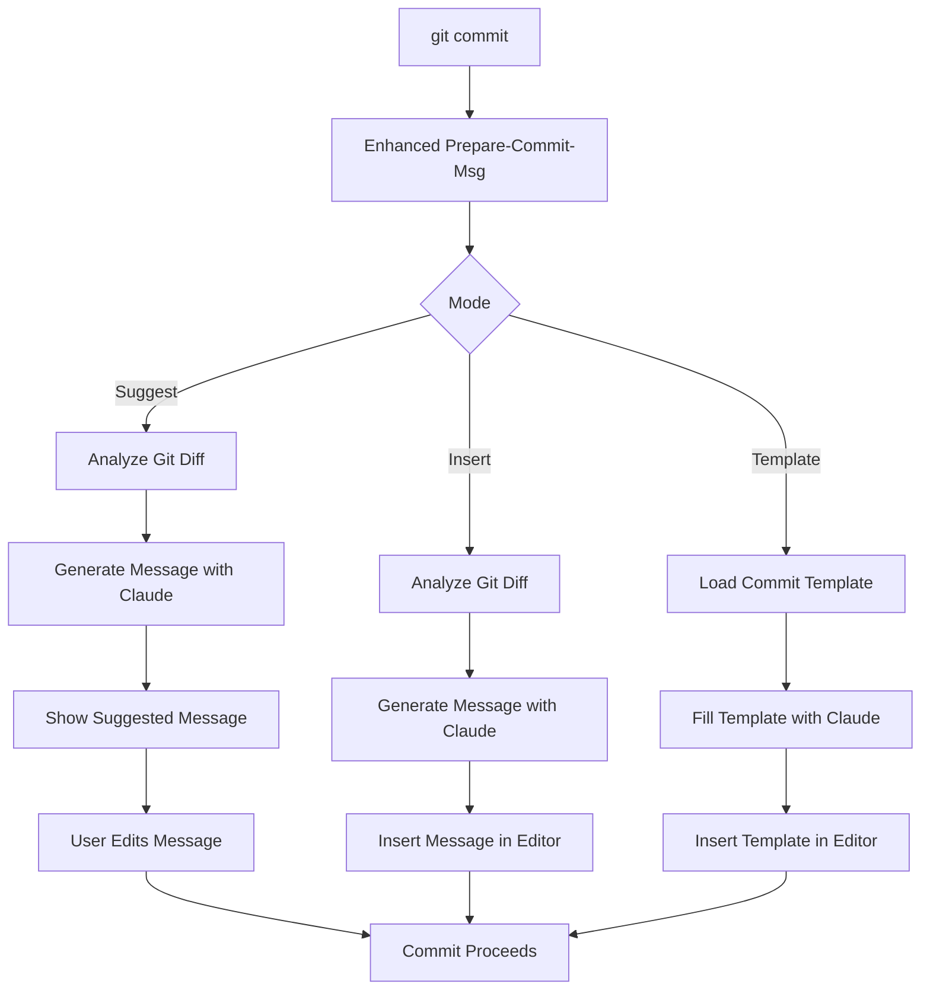
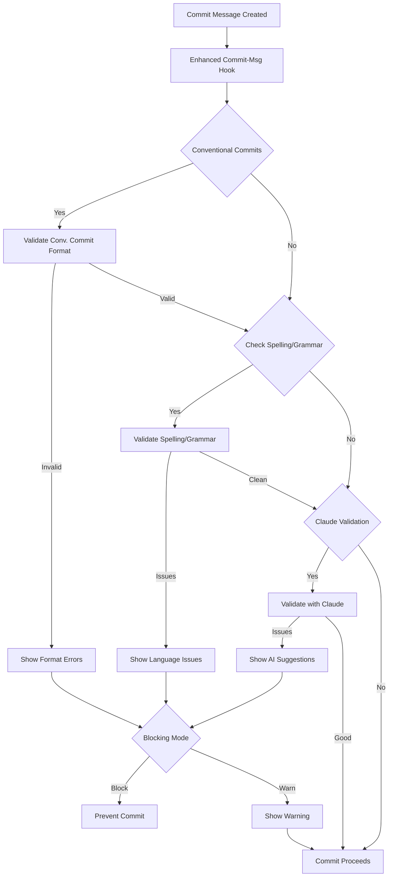

# Enhanced Git Hooks with AI Coding Assistants

<div align="center">


**Intelligent Git hooks for TypeScript, linting, formatting and AI-powered code reviews**

</div>

## 📑 Table of Contents

- [Overview](#-overview)
- [Features](#-features)
- [Getting Started](#-getting-started)
- [Project Capability Detection](#-project-capability-detection)
- [Hook Implementations](#-hook-implementations)
  - [Enhanced Pre-Commit Hook](#enhanced-pre-commit-hook)
  - [Enhanced Prepare-Commit-Msg Hook](#enhanced-prepare-commit-msg-hook)
  - [Enhanced Commit-Msg Hook](#enhanced-commit-msg-hook)
- [Middleware Architecture](#-middleware-architecture)
- [Configuration Reference](#-configuration-reference)
- [Example Prompts for Claude](#-example-prompts-for-claude)
- [Troubleshooting](#-troubleshooting)
- [Advanced Usage](#-advanced-usage)
  - [Custom Middleware](#custom-middleware)
  - [Event System](#event-system)
  - [Performance Optimization](#performance-optimization)
- [Security Considerations](#-security-considerations)

## 🔍 Overview

Enhanced Git hooks extend the standard Git hooks system with intelligent code quality checks and Claude AI integration. The system automatically detects your project's capabilities (TypeScript, linting, formatting, commit validation) and offers relevant hooks during setup, ensuring that your Git workflow includes appropriate quality checks without requiring manual configuration.

## ✨ Features

### Code Quality Integration

- **TypeScript Type Checking**: Automatically runs `tsc --noEmit` or your custom type-checking script
- **Linting**: Integrates with ESLint, TSLint, or Standard to catch code quality issues
- **Formatting**: Runs Prettier, ESLint+Prettier, or other formatters to ensure consistent style
- **Conventional Commits**: Validates and enforces conventional commit format
- **Commit Message Quality**: Checks spelling, grammar, and clarity of commit messages

### AI-Powered Assistance

- **Intelligent Code Review**: Claude analyzes staged code for potential issues
- **Commit Message Generation**: AI-generated commit messages based on your changes
- **Context Awareness**: Understands relationships between files and their purpose
- **Improvement Suggestions**: Offers concrete improvements for identified issues
- **Security Vulnerability Detection**: Identifies potential security problems

### Advanced Architecture

- **Middleware Pipeline**: Extensible hook execution flow with before/during/after phases
- **Event System**: Hook events that you can listen to and respond to
- **Claude Integration**: Seamless integration with Claude CLI
- **Performance Optimization**: Smart caching to avoid redundant operations
- **Configurable Strictness**: Choose how strict the hook validation should be

## 🚀 Getting Started

The enhanced hooks are automatically offered during the standard AI Coding Assistants setup process. When you run the setup script:

```bash
npx ai-coding-assistants-setup
```

During setup, the wizard will:

1. Detect your project's capabilities (TypeScript, linting, etc.)
2. Offer appropriate enhanced hooks based on detected capabilities
3. Configure the hooks with sensible defaults
4. Create any missing npm scripts needed to run the hooks

### Manual Hook Configuration

To specifically configure enhanced hooks:

```bash
npx ai-coding-assistants-setup --hooks
```

And select the enhanced hooks you want to enable.

## 🔍 Project Capability Detection

The setup wizard automatically detects your project capabilities:

### TypeScript Detection

- Checks for `tsconfig.json` file
- Looks for TypeScript dependencies in `package.json`
- Scans for `.ts` or `.tsx` files in your project
- Identifies existing TypeScript-related npm scripts

### Linting Detection

- Identifies ESLint (`.eslintrc.*` files, `eslint` dependency)
- Detects TSLint (`tslint.json`, `tslint` dependency)
- Finds Standard JS configuration (`standard` dependency)
- Checks for existing lint-related npm scripts

### Formatting Detection

- Recognizes Prettier (`.prettierrc.*` files, `prettier` dependency)
- Identifies ESLint+Prettier integration (`eslint-plugin-prettier`)
- Detects formatting-related npm scripts

### Commit Validation Detection

- Finds commitlint (`.commitlintrc.*` files, `commitlint` dependency)
- Detects husky or other commit message validation tools
- Identifies custom commit message templates or validation scripts

## 🪝 Hook Implementations

### Enhanced Pre-Commit Hook

The enhanced pre-commit hook runs before a commit is created to ensure code quality:



#### Features:

- **Type Checking**: Ensures TypeScript code is type-safe
- **Linting**: Validates code against linting rules
- **Formatting**: Ensures consistent code style
- **AI Review**: Uses Claude to identify code issues
- **Configurable Strictness**: Block, warn, or allow with issues
- **Smart Caching**: Only rechecks files that have changed
- **Performance Optimization**: Runs checks in parallel when possible

#### Configuration Options:

```json
{
  "hooks": {
    "enhanced-pre-commit": {
      "enabled": true,
      "blockingMode": "warn",      // "block", "warn", or "none"
      "strictness": "medium",      // "low", "medium", or "high"
      "reviewTypes": ["bugs", "security", "best-practices"],
      "typeCheck": {
        "enabled": true,
        "scriptName": "types:check"
      },
      "linting": {
        "enabled": true,
        "linter": "eslint",       // "eslint", "tslint", or "standard"
        "scriptName": "lint"
      },
      "formatting": {
        "enabled": true,
        "formatter": "prettier",  // "prettier", "eslint-prettier"
        "scriptName": "format"
      },
      "claudeReview": {
        "enabled": true,
        "useCli": true,          // Use Claude CLI if available
        "sendFullFiles": false,   // Send entire files or just changes
        "maxFiles": 10,          // Maximum files to review
        "maxSizePerFile": 50000  // Maximum file size in bytes
      }
    }
  }
}
```

### Enhanced Prepare-Commit-Msg Hook

The enhanced prepare-commit-msg hook generates or suggests commit messages:



#### Features:

- **Multiple Modes**: Suggest, insert, or template-based
- **Conventional Commits**: Support for conventional commit format
- **Smart Analysis**: Understands the nature of code changes
- **Issue References**: Can include issue numbers from branch names
- **Breaking Change Detection**: Identifies potentially breaking changes
- **Context Awareness**: References related files and components
- **Multiple Styles**: Concise or detailed message options

#### Configuration Options:

```json
{
  "hooks": {
    "enhanced-prepare-commit-msg": {
      "enabled": true,
      "mode": "suggest",          // "suggest", "insert", or "template"
      "conventionalCommits": true,
      "includeScope": true,
      "includeBreaking": true,
      "messageStyle": "detailed", // "concise" or "detailed"
      "extractIssueFromBranch": true,
      "issuePattern": "[A-Z]+-\\d+",
      "claude": {
        "useCli": true,
        "model": "claude-3-opus-20240229"
      },
      "template": {
        "path": ".github/commit-template",
        "fillPlaceholders": true
      }
    }
  }
}
```

### Enhanced Commit-Msg Hook

The enhanced commit-msg hook validates and improves commit messages:



#### Features:

- **Conventional Commit Validation**: Ensures proper format (type, scope, subject)
- **Spelling and Grammar Check**: Validates message language quality
- **Length Verification**: Enforces subject and body length limits
- **AI Validation**: Uses Claude to validate message quality
- **Auto-fix Support**: Can automatically fix common issues
- **Improvement Suggestions**: Offers specific improvements
- **Configurable Rules**: Customizable validation based on project needs

#### Configuration Options:

```json
{
  "hooks": {
    "enhanced-commit-msg": {
      "enabled": true,
      "blockingMode": "warn",      // "block", "warn", or "none"
      "conventionalCommits": true,
      "checkSpelling": true,
      "checkGrammar": true,
      "maxLength": {
        "subject": 72,
        "body": 100
      },
      "suggestImprovements": true,
      "autoFix": {
        "enabled": true,
        "capitalization": true,
        "punctuation": true,
        "typos": true
      },
      "claude": {
        "useCli": true,
        "model": "claude-3-sonnet-20240229"
      }
    }
  }
}
```

## 🧩 Middleware Architecture

Enhanced hooks use a middleware pattern for extensibility. Each hook supports middleware for different lifecycle phases:

```javascript
// Middleware phases for hook lifecycle
const HookLifecycle = {
  BEFORE_EXECUTION: 'before_execution',
  EXECUTION: 'execution',
  AFTER_EXECUTION: 'after_execution',
  ERROR: 'error'
};

// Example middleware
const myCustomMiddleware = async (context, next) => {
  // Do something before next middleware
  console.log('Before execution');
  
  // Call next middleware
  await next();
  
  // Do something after next middleware
  console.log('After execution');
};

// Register middleware with a hook
hook.use(HookLifecycle.BEFORE_EXECUTION, myCustomMiddleware);
```

The middleware pipeline allows for:
- **Pre-processing**: Prepare or modify input before the hook runs
- **Post-processing**: Transform or use output after the hook runs
- **Error handling**: Custom error processing
- **Monitoring**: Track performance or add logging
- **Conditional execution**: Skip or modify hook behavior based on conditions

## ⚙️ Configuration Reference

Full configuration options can be defined in `.claude/hooks.json`:

```json
{
  "hooks": {
    "enhanced-pre-commit": {
      "enabled": true,
      "blockingMode": "warn",
      "strictness": "medium",
      "reviewTypes": ["bugs", "security", "best-practices"],
      "typeCheck": {
        "enabled": true,
        "scriptName": "types:check",
        "allowPartial": true,
        "incremental": true
      },
      "linting": {
        "enabled": true,
        "linter": "eslint",
        "scriptName": "lint",
        "fix": true,
        "cacheResults": true
      },
      "formatting": {
        "enabled": true,
        "formatter": "prettier",
        "scriptName": "format",
        "formatStagedOnly": true
      },
      "claudeReview": {
        "enabled": true,
        "useCli": true,
        "model": "claude-3-opus-20240229",
        "temperature": 0.7,
        "maxOutputTokens": 2000,
        "sendFullFiles": false,
        "maxFiles": 10,
        "maxSizePerFile": 50000,
        "includeUnstagedContext": true,
        "skipBinary": true,
        "skipGenerated": true,
        "templatePath": ".claude/templates/code-review-template.hbs"
      }
    },
    "enhanced-prepare-commit-msg": {
      "enabled": true,
      "mode": "suggest",
      "conventionalCommits": true,
      "includeScope": true,
      "includeBreaking": true,
      "messageStyle": "detailed",
      "extractIssueFromBranch": true,
      "issuePattern": "[A-Z]+-\\d+",
      "claude": {
        "useCli": true,
        "model": "claude-3-sonnet-20240229",
        "temperature": 0.7,
        "maxOutputTokens": 1000,
        "sendFullDiff": false,
        "maxDiffSize": 25000,
        "templatePath": ".claude/templates/commit-message-template.hbs"
      },
      "template": {
        "path": ".github/commit-template",
        "fillPlaceholders": true
      }
    },
    "enhanced-commit-msg": {
      "enabled": true,
      "blockingMode": "warn",
      "conventionalCommits": true,
      "checkSpelling": true,
      "checkGrammar": true,
      "maxLength": {
        "subject": 72,
        "body": 100
      },
      "suggestImprovements": true,
      "autoFix": {
        "enabled": true,
        "capitalization": true,
        "punctuation": true,
        "typos": true
      },
      "claude": {
        "useCli": true,
        "model": "claude-3-sonnet-20240229",
        "temperature": 0.5,
        "maxOutputTokens": 500,
        "templatePath": ".claude/templates/commit-validate-template.hbs"
      }
    }
  }
}
```

## 💬 Example Prompts for Claude

### Pre-Commit Code Review Prompt

```
You are a code review assistant. Please review the following staged changes and identify any issues, bugs, 
or improvements. Focus on {{focus_areas}}.

The changes are being made to a {{project_type}} project.

Staged changes:
{{staged_diff}}

Additional context:
- Project uses {{language}} with {{framework}} framework
- Current branch: {{branch_name}}
- Related files: {{related_files}}

Please provide a thorough review highlighting:
1. Potential bugs or logic errors
2. Security vulnerabilities
3. Performance issues
4. Code quality improvements
5. Best practices specific to {{language}} and {{framework}}

Provide specific, actionable feedback with line references where possible.
```

### Prepare-Commit-Msg Prompt

```
You are a commit message generation assistant. Based on the following code changes, 
generate a clear and informative commit message.

{{#if conventionalCommits}}
Follow the Conventional Commits format:
<type>[optional scope]: <description>

[optional body]

[optional footer(s)]

Types include: feat, fix, docs, style, refactor, perf, test, build, ci, chore, revert.
{{/if}}

Code changes:
{{diff}}

Branch name: {{branch_name}}
{{#if issueNumber}}Related issue: {{issueNumber}}{{/if}}

Your commit message should:
1. Be clear and concise
2. Explain WHY the change was made
3. Focus on the intent, not just what was changed
4. Use present tense verbs
5. Be specific rather than general

{{#if messageStyle == "detailed"}}
Provide a more detailed explanation in the commit body.
{{else}}
Keep the message concise.
{{/if}}

{{#if includeBreaking}}
If this change includes breaking changes, please include a BREAKING CHANGE: footer.
{{/if}}
```

### Commit-Msg Validation Prompt

```
You are a commit message validator. Review the following commit message and determine if it meets quality standards.

Commit message:
{{commit_message}}

{{#if conventionalCommits}}
This project uses Conventional Commits format:
<type>[optional scope]: <description>

[optional body]

[optional footer(s)]

Types should be one of: feat, fix, docs, style, refactor, perf, test, build, ci, chore, revert.
{{/if}}

Please evaluate the commit message based on:
1. Clarity: Is the message clear and descriptive?
2. Completeness: Does it explain what and why?
3. Formatting: Does it follow project conventions?
4. Grammar/Spelling: Are there language issues?
5. Length: Is the subject line concise (under 72 chars)?

If issues are found, please suggest improvements.
```

## 🔧 Troubleshooting

### Common Issues and Solutions

| Issue | Cause | Solution |
|-------|-------|----------|
| "No npm script found for TypeScript" | Missing type check script | Add `"types:check": "tsc --noEmit"` to package.json scripts |
| "Cannot find module 'typescript'" | TypeScript not installed | Install TypeScript: `npm install --save-dev typescript` |
| "ESLint not configured" | Missing ESLint configuration | Run `npx eslint --init` to configure ESLint |
| "Claude CLI error" | Claude CLI not installed or configured | Ensure Claude CLI is properly installed and configured |
| "Hook exited with code 1" | Blocking validation issue | Fix the reported issues or use `git commit --no-verify` to bypass |
| "Hook taking too long" | Large codebase or slow validation | Add `.claudeignore` patterns to exclude large directories |
| "Operation not permitted" | Hook script not executable | Run `chmod +x .git/hooks/pre-commit` |
| "File not staged for commit" | Trying to run check on unstaged files | Stage your changes with `git add` first |

### Debugging Hooks

To debug hooks, set the debug environment variable:

```bash
CLAUDE_DEBUG=true git commit -m "Test commit"
```

This will produce verbose logs in `.claude/logs/hooks.log`.

To temporarily disable hooks:

```bash
# Disable all hooks
git commit --no-verify

# Disable specific hooks
CLAUDE_SKIP_ENHANCED_PRE_COMMIT=true git commit
```

## 🔄 Advanced Usage

### Custom Middleware

Create custom middleware to extend hook functionality:

```javascript
// Custom middleware to track hook performance
const performanceMonitorMiddleware = async (context, next) => {
  const startTime = Date.now();
  
  try {
    // Execute next middleware in chain
    await next();
  } finally {
    const endTime = Date.now();
    const duration = endTime - startTime;
    
    console.log(`Hook ${context.hookId} executed in ${duration}ms`);
    
    // Log to file if it took too long
    if (duration > 5000) {
      fs.appendFileSync(
        '.claude/logs/performance.log',
        `[${new Date().toISOString()}] ${context.hookId}: ${duration}ms\n`
      );
    }
  }
};

// Register with a hook
hook.use(HookLifecycle.BEFORE_EXECUTION, performanceMonitorMiddleware);
```

### Event System

Listen to hook events to integrate with other systems:

```javascript
// Example event listener
hook.on('pre-commit:complete', (data) => {
  // Send notification if issues were found
  if (data.result.issues.length > 0) {
    notifyTeam({
      hook: 'pre-commit',
      issueCount: data.result.issues.length,
      summary: data.result.summary
    });
  }
});

// Emit custom events
hook.emit('custom:event', { data: 'value' });
```

### Performance Optimization

For large repositories, optimize performance:

```json
{
  "hooks": {
    "enhanced-pre-commit": {
      "typeCheck": {
        "incremental": true,
        "cache": true,
        "memoryLimit": "4096mb"
      },
      "linting": {
        "cacheResults": true,
        "maxParallel": 4
      },
      "claudeReview": {
        "sendFullFiles": false,
        "maxFiles": 5,
        "skipGenerated": true,
        "skipPatterns": ["*.min.js", "*.bundle.js", "vendor/**"]
      }
    }
  }
}
```

Add a `.claudeignore` file for files to exclude:

```
# Large directories
node_modules/
dist/
build/

# Generated files
*.generated.ts
*.d.ts

# Test data
__tests__/fixtures/
__mocks__/

# Temporary files
.tmp/
```

## 🔒 Security Considerations

- **Code Transmission**: Code changes are processed by Claude CLI
- **Security**: Only uses local Claude CLI for code analysis
- **Generated Code**: Review AI-generated commit messages before accepting
- **Auto-fixing**: Be cautious with auto-fix features for critical code
- **Bypass Risks**: Using `--no-verify` bypasses all quality checks

## 📜 License

This project is licensed under the MIT License - see the [LICENSE.md](../LICENSE.md) file for details.

---

<div align="center">
Made with ❤️ by the AI Coding Assistants Setup team
</div>