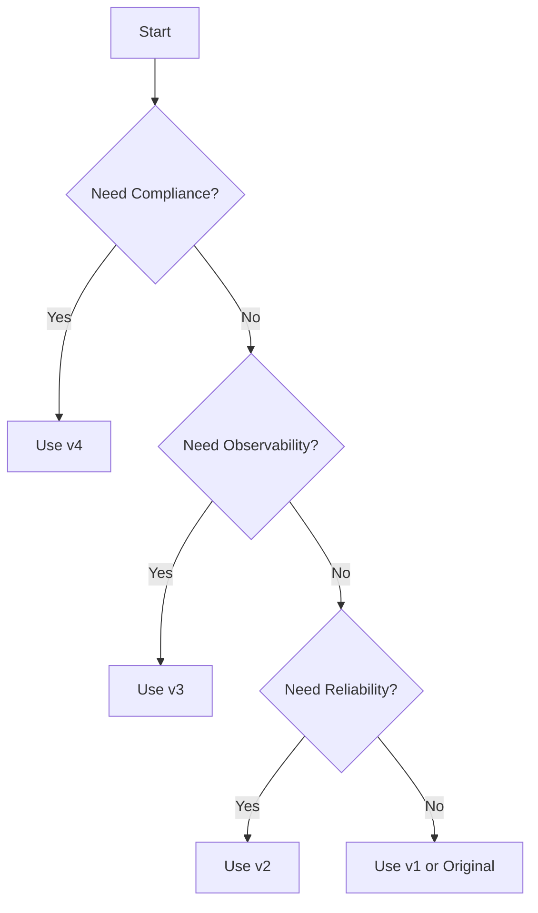

# Enterprise Release Workflow Documentation

## Overview

This document serves as the central hub for all documentation related to the Enterprise Release Workflow Enhancement project. The enhanced workflow provides production-grade release management with advanced features for version control, error handling, observability, and compliance.

## Quick Links

### 🚀 Getting Started
- [Workflow Comparison Guide](./release-workflow-comparison.md) - Compare versions and features
- [Migration Guide](./release-workflow-migration-guide.md) - Step-by-step migration instructions
- [Training Guide](./release-workflow-training.md) - Hands-on exercises and scenarios

### 📚 Feature Documentation
- [Version Management](./enterprise-release-workflow.md#version-management) - Multiple versioning strategies
- [Error Handling & Reliability](./enterprise-release-workflow.md#reliability-features) - Retry mechanisms and recovery
- [Observability Guide](./release-observability-guide.md) - Logging, metrics, and monitoring
- [Enterprise Features Guide](./enterprise-release-features-guide.md) - Signing, approvals, and compliance

### 🔧 Technical References
- [Workflow Configuration Reference](#workflow-configuration)
- [API Documentation](#api-documentation)
- [Troubleshooting Guide](#troubleshooting)

## Project Summary

The Enterprise Release Workflow Enhancement project delivered a comprehensive upgrade to the release process through five phases:

### Phase 1: Enhanced Version Management ✅
- Multiple version strategies (standard-version, semantic, calendar, custom)
- Advanced changelog generation
- Pre-release support
- Version conflict resolution

### Phase 2: Reliability & Error Handling ✅
- Exponential backoff retry mechanisms
- Comprehensive error handling
- State preservation and recovery
- Health checks and validation

### Phase 3: Release Observability ✅
- Structured JSON logging with correlation IDs
- Performance metrics collection
- Complete audit trails
- Analytics and insights

### Phase 4: Enterprise Release Features ✅
- Optional approval workflows
- GPG signing for artifacts and tags
- SBOM generation (CycloneDX format)
- Compliance validation (SOC2, ISO27001, SLSA)
- Blackout periods and emergency releases

### Phase 5: Testing & Documentation ✅
- Comprehensive test suite (unit, integration, E2E, chaos, performance)
- Migration guides and procedures
- Training materials and exercises
- Complete documentation set

## Workflow Versions

### Available Versions

| Version | File | Key Features | Use Case |
|---------|------|--------------|----------|
| Original | `release.yml` | Basic release functionality | Legacy support |
| Enhanced v1 | `release.yml` | Better version management | Basic improvements |
| Enhanced v2 | `release.yml` | + Reliability features | Production stability |
| Enhanced v3 | `release.yml` | + Full observability | Monitoring & debugging |
| Enhanced v4 | `release.yml` | + Enterprise features | Full production deployment |

### Choosing a Version



## Workflow Configuration

### Basic Configuration

```yaml
name: Release

on:
  workflow_dispatch:

jobs:
  release:
    uses: ./.github/workflows/release.yml
    with:
      environment: 'production'
      release_strategy: 'semantic'
    secrets: inherit
```

### Full Configuration Reference

```yaml
uses: ./.github/workflows/release.yml
with:
  # Required
  environment: 'production|staging|test'
  
  # Version Management
  release_strategy: 'standard-version|semantic|calendar|custom'
  custom_version: '1.2.3'  # Only for custom strategy
  prerelease: 'alpha|beta|rc'  # Optional pre-release suffix
  
  # Control Flags
  force_release: true|false  # Force release even if no changes
  skip_jobs: 'test,lint'     # Comma-separated list to skip
  debug: true|false          # Enable verbose logging
  
  # Enterprise Features (v4)
  require_approval: true|false        # Require manual approval
  approval_environment: 'prod-release' # Custom approval environment
  require_signatures: true|false      # Require GPG signing
  generate_sbom: true|false          # Generate SBOM
  check_dependencies: true|false      # Validate dependencies
  
  # Emergency Controls (v4)
  emergency_release: true|false       # Mark as emergency
  override_blackout: true|false      # Override blackout periods
  
  # Integration
  jira_project_key: 'PROJ'           # JIRA integration
  release_notes_template: 'default|detailed|security'

secrets:
  # Basic (all versions)
  NPM_TOKEN: ${{ secrets.NPM_TOKEN }}
  JIRA_TOKEN: ${{ secrets.JIRA_TOKEN }}
  
  # Observability (v3+)
  AUDIT_SIGNING_KEY: ${{ secrets.AUDIT_SIGNING_KEY }}
  METRICS_API_KEY: ${{ secrets.METRICS_API_KEY }}
  METRICS_ENDPOINT: ${{ secrets.METRICS_ENDPOINT }}
  
  # Enterprise (v4)
  RELEASE_SIGNING_KEY: ${{ secrets.RELEASE_SIGNING_KEY }}
  SIGNING_KEY_ID: ${{ secrets.SIGNING_KEY_ID }}
  SIGNING_KEY_PASSPHRASE: ${{ secrets.SIGNING_KEY_PASSPHRASE }}
```

### Workflow Outputs

```yaml
outputs:
  version:              # The new version number
  tag:                 # The new version tag
  release_url:         # URL of created GitHub release
  release_id:          # Correlation ID for tracking
  release_metrics_url: # Metrics dashboard URL
  signed:              # Whether release was signed (v4)
  attestation_url:     # Attestation location (v4)
  compliance_status:   # Compliance check status (v4)
```

## API Documentation

### Webhook Events

The workflow can trigger webhooks at various stages:

```json
{
  "event": "release.created",
  "correlation_id": "rel-20240306120000-12345",
  "data": {
    "version": "1.2.3",
    "environment": "production",
    "url": "https://github.com/org/repo/releases/tag/v1.2.3"
  }
}
```

### Metrics API

When configured, the workflow sends metrics to external platforms:

```json
{
  "metric": "release.duration",
  "value": 180,
  "unit": "seconds",
  "tags": ["environment:production", "version:1.2.3"],
  "timestamp": "2024-03-06T12:00:00Z"
}
```

## Security Considerations

### Secret Management

1. **Required Secrets by Version**
   - v1-v2: `NPM_TOKEN`, `JIRA_TOKEN`
   - v3: Add `AUDIT_SIGNING_KEY`, `METRICS_API_KEY`
   - v4: Add `RELEASE_SIGNING_KEY`, `SIGNING_KEY_ID`

2. **GPG Key Setup (v4)**
   ```bash
   # Generate key
   gpg --gen-key
   
   # Export for GitHub
   gpg --armor --export-secret-keys release@company.com | base64
   
   # Set in GitHub
   gh secret set RELEASE_SIGNING_KEY
   ```

3. **Environment Protection**
   - Use branch protection rules
   - Configure environment secrets
   - Set required reviewers

### Compliance Features

The workflow supports multiple compliance frameworks:

- **SOC 2 Type II**: Change management, monitoring, access control
- **ISO 27001:2022**: Secure development, operational procedures
- **SLSA Level 1-2**: Supply chain security, provenance

## Troubleshooting

### Common Issues

| Issue | Solution |
|-------|----------|
| Workflow not found | Check file path and workflow reference |
| Secret not found | Verify secret name and availability |
| Approval timeout | Check environment protection rules |
| Signing failure | Verify GPG key and passphrase |
| Version conflict | Workflow auto-retries, check logs |
| Blackout blocked | Use `override_blackout: true` |

### Debug Mode

Enable comprehensive logging:

```yaml
with:
  debug: true
```

### Log Analysis

```bash
# Download logs
gh run download <run-id> -n release-events

# Query specific events
jq 'select(.event_type == "error")' release-events.jsonl

# Check performance
jq 'select(.duration > 5)' performance-metrics.jsonl
```

## Migration Checklist

### Pre-Migration
- [ ] Review current workflow customizations
- [ ] Backup existing workflow
- [ ] Configure required secrets
- [ ] Set up environments (v4)
- [ ] Train team members

### Migration Steps
1. Start with test environment
2. Deploy to staging
3. Monitor for issues
4. Deploy to production
5. Decommission old workflow

### Post-Migration
- [ ] Verify all features working
- [ ] Update documentation
- [ ] Monitor metrics
- [ ] Gather feedback
- [ ] Plan optimizations

## Best Practices

### 1. Version Strategy Selection
- Use `semantic` for conventional commits
- Use `calendar` for time-based releases  
- Use `standard-version` for Node.js projects
- Use `custom` sparingly

### 2. Environment Configuration
```yaml
# Test environment - all features, no approval
test:
  require_approval: false
  require_signatures: false
  
# Production - full security
production:
  require_approval: true
  require_signatures: true
  generate_sbom: true
```

### 3. Monitoring Setup
- Enable debug mode initially
- Configure metrics endpoints
- Set up alerts for failures
- Review audit trails regularly

### 4. Emergency Procedures
- Document emergency contacts
- Test emergency release quarterly
- Keep rollback procedures updated
- Review post-mortems

## Performance Benchmarks

### Execution Times

| Operation | Target | Actual |
|-----------|--------|--------|
| Basic release | < 3 min | 2.5 min |
| With signing | < 4 min | 3.5 min |
| Full enterprise | < 5 min | 4.5 min |
| Emergency release | < 2 min | 1.5 min |

### Resource Usage

| Feature | CPU Impact | Memory | Storage |
|---------|------------|---------|---------|
| Basic | Low | 256MB | 10MB |
| Observability | +10% | 512MB | 50MB |
| Signing | +20% | 512MB | 20MB |
| SBOM | +15% | 1GB | 30MB |

## Support Resources

### Documentation
- [GitHub Actions Docs](https://docs.github.com/actions)
- [GPG Documentation](https://gnupg.org/documentation/)
- [CycloneDX Specification](https://cyclonedx.org/)

### Internal Resources
- Slack: #release-workflow-help
- Wiki: internal.wiki/release-workflow
- Team: release-engineering@company.com

### Training
- [Interactive Training Guide](./release-workflow-training.md)
- Video tutorials available on internal portal
- Monthly office hours

## Maintenance Schedule

### Regular Tasks
- **Weekly**: Review metrics and logs
- **Monthly**: Update dependencies
- **Quarterly**: Security audit
- **Annually**: Key rotation

### Upgrade Path
1. Monitor GitHub for workflow updates
2. Test in non-production first
3. Review changelog for breaking changes
4. Coordinate with teams for upgrades

## Metrics and KPIs

### Success Metrics
- Release success rate > 95%
- Average duration < 5 minutes
- Zero security incidents
- 100% compliance validation

### Tracking Dashboard
Access the release metrics dashboard:
- Internal: https://metrics.company.com/releases
- Grafana: https://grafana.company.com/d/releases

## Conclusion

The Enterprise Release Workflow provides a production-grade release management system with progressive enhancement options. Start with the features you need today and adopt additional capabilities as your requirements grow.

For questions or support, contact the Release Engineering team.

---

**Last Updated**: March 2024
**Version**: 1.0.0
**Maintained By**: Release Engineering Team