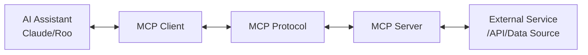

# Model Context Protocol (MCP) Reference

<div align="center">


**Comprehensive guide to MCP servers for extending AI assistant capabilities**

</div>

## 📑 Table of Contents

- [Model Context Protocol (MCP) Reference](#model-context-protocol-mcp-reference)
  - [📑 Table of Contents](#-table-of-contents)
  - [🔍 Overview](#-overview)
  - [🏗️ MCP Architecture](#️-mcp-architecture)
  - [📋 Supported MCP Servers](#-supported-mcp-servers)
    - [GitHub](#github)
      - [Example Configuration](#example-configuration)
      - [Example Usage Prompts](#example-usage-prompts)
    - [Context7](#context7)
      - [Example Configuration](#example-configuration-1)
      - [Example Usage Prompts](#example-usage-prompts-1)
    - [Memory](#memory)
      - [Example Configuration](#example-configuration-2)
      - [Example Usage Prompts](#example-usage-prompts-2)
    - [Task Master AI](#task-master-ai)
      - [Example Configuration](#example-configuration-3)
      - [Example Usage Prompts](#example-usage-prompts-3)
    - [StackOverflow](#stackoverflow)
      - [Example Configuration](#example-configuration-4)
      - [Example Usage Prompts](#example-usage-prompts-4)
    - [Command Shell](#command-shell)
      - [Example Configuration](#example-configuration-5)
      - [Example Usage Prompts](#example-usage-prompts-5)
    - [Fetch](#fetch)
      - [Example Configuration](#example-configuration-6)
      - [Example Usage Prompts](#example-usage-prompts-6)
    - [Playwright](#playwright)
      - [Example Configuration](#example-configuration-7)
      - [Example Usage Prompts](#example-usage-prompts-7)
    - [Browser](#browser)
      - [Example Configuration](#example-configuration-8)
      - [Example Usage Prompts](#example-usage-prompts-8)
    - [Jira](#jira)
      - [Example Configuration](#example-configuration-9)
      - [Example Usage Prompts](#example-usage-prompts-9)
    - [Brave Search](#brave-search)
      - [Example Configuration](#example-configuration-10)
      - [Example Usage Prompts](#example-usage-prompts-10)
    - [FileSystem](#filesystem)
      - [Example Configuration](#example-configuration-11)
      - [Example Usage Prompts](#example-usage-prompts-11)
  - [⚙️ Configuration Management](#️-configuration-management)
    - [Configuration Files](#configuration-files)
    - [Environment Variables](#environment-variables)
    - [Configuration Hierarchy](#configuration-hierarchy)
  - [🔒 Security Best Practices](#-security-best-practices)
  - [🔧 Advanced Configuration](#-advanced-configuration)
    - [Auto-Approve Lists](#auto-approve-lists)
    - [Docker Configuration](#docker-configuration)
    - [Startup Parameters](#startup-parameters)
  - [🛠️ Troubleshooting](#️-troubleshooting)
    - [Common MCP Issues](#common-mcp-issues)
    - [Startup Diagnostics](#startup-diagnostics)
    - [Server-Specific Troubleshooting](#server-specific-troubleshooting)
      - [GitHub MCP](#github-mcp)
      - [Context7 MCP](#context7-mcp)
      - [Memory MCP](#memory-mcp)
  - [🧩 Creating Custom MCPs](#-creating-custom-mcps)
    - [Communication Protocol](#communication-protocol)
    - [Implementation Guide](#implementation-guide)
    - [Example Implementations](#example-implementations)
      - [Minimal Node.js MCP Server](#minimal-nodejs-mcp-server)
      - [Python MCP Server Example](#python-mcp-server-example)
  - [📚 Further Reading](#-further-reading)
  - [📜 License](#-license)

## 🔍 Overview

Model Context Protocols (MCPs) are standardized interfaces that enable AI assistants to interact with external tools, data sources, and services. They extend the capabilities of Claude Code and Roo Code by providing access to information beyond the models' training data or enabling actions they couldn't perform natively.

MCPs follow a standardized JSON protocol for communication, making them interoperable between different AI assistants. The AI Coding Assistants Setup script simplifies configuring and using these powerful extensions, ensuring a consistent experience across your entire development team.

## 🏗️ MCP Architecture

MCPs employ a client-server architecture:



1. **AI Assistant**: Claude Code or Roo Code, which needs extended capabilities
2. **MCP Client**: Built into the AI assistant, sends standardized requests
3. **MCP Protocol**: JSON-based communication protocol over stdin/stdout
4. **MCP Server**: Standalone program that implements the protocol
5. **External Service**: GitHub, docs, shell, browser, etc.

Each MCP server is a standalone program that:
- Accepts JSON requests via stdin
- Processes requests using its specialized capabilities
- Returns responses as JSON via stdout
- Manages authentication with external services
- Handles errors and provides informative messages

## 📋 Supported MCP Servers

### GitHub

Provides repository awareness and GitHub API access. Allows Claude/Roo to read code, issues, PRs, and more from GitHub repositories.

| Aspect | Details |
|--------|---------|
| **Capabilities** | Repository browsing, issue/PR management, code search, commit viewing, user interaction |
| **Configuration Requirements** | Docker installation for running the official GitHub MCP server |
| **API Keys/Credentials** | GitHub Personal Access Token with repo and user scopes |
| **Rate Limits** | Subject to GitHub API rate limits (5000 req/hr for authenticated users) |

#### Example Configuration

```json
{
  "mcpServers": {
    "github": {
      "command": "docker",
      "args": ["run", "-i", "--rm", "-e", "GITHUB_PERSONAL_ACCESS_TOKEN", "ghcr.io/github/github-mcp-server"],
      "env": {
        "GITHUB_PERSONAL_ACCESS_TOKEN": "${GITHUB_PERSONAL_ACCESS_TOKEN}"
      }
    }
  }
}
```

#### Example Usage Prompts

```
// Get repository information
Let me check the details of this repository for you using GitHub MCP.
@github get_repository --owner "anthropics" --repo "claude-code"

// Search for code
I'll find examples of how this function is used in the codebase.
@github search_code --q "function calculateTotal" --in:file --language:typescript

// List pull requests
Let me show you all open pull requests.
@github list_pull_requests --owner "anthropics" --repo "claude-code" --state "open"

// Create issue
I'll create an issue to track this bug.
@github create_issue --owner "anthropics" --repo "claude-code" --title "Fix authentication timeout bug" --body "Users experience authentication timeouts after 5 minutes of inactivity."
```

### Context7

Provides up-to-date documentation and code understanding for thousands of libraries. Helps Claude/Roo access documentation without using tokens for common libraries.

| Aspect | Details |
|--------|---------|
| **Capabilities** | Documentation lookup, code explanations, API references, usage examples |
| **Configuration Requirements** | NPX package installation capability |
| **API Keys/Credentials** | Context7 API Key |
| **Rate Limits** | Free tier: 100 req/day; Paid tiers available for higher usage |

#### Example Configuration

```json
{
  "mcpServers": {
    "context7-mcp": {
      "command": "npx",
      "args": ["-y", "@upstash/context7-mcp@latest"],
      "env": {
        "CONTEXT7_API_KEY": "${CONTEXT7_API_KEY}"
      }
    }
  }
}
```

#### Example Usage Prompts

```
// Look up React documentation
Let me find the official documentation for React hooks.
@context7-mcp resolve-library-id --libraryName "react"
@context7-mcp get-library-docs --context7CompatibleLibraryID "facebook/react" --topic "hooks"

// Understand TypeScript features
I'll get you the latest documentation on TypeScript interfaces.
@context7-mcp resolve-library-id --libraryName "typescript"
@context7-mcp get-library-docs --context7CompatibleLibraryID "microsoft/typescript" --topic "interfaces"

// Find Express.js routing examples
Let me pull up the latest Express.js routing documentation.
@context7-mcp resolve-library-id --libraryName "express"
@context7-mcp get-library-docs --context7CompatibleLibraryID "expressjs/express" --topic "routing"
```

### Memory

Provides persistent memory between sessions for Claude/Roo, allowing knowledge to persist across sessions in a knowledge graph.

| Aspect | Details |
|--------|---------|
| **Capabilities** | Knowledge persistence, entity relationships, semantic search, context management |
| **Configuration Requirements** | Storage location accessible for writing |
| **API Keys/Credentials** | None |
| **Rate Limits** | Storage limited by file system capacity |

#### Example Configuration

```json
{
  "mcpServers": {
    "memory": {
      "command": "npx",
      "args": ["-y", "mcp-knowledge-graph", "--memory-path", "${MEMORY_PATH}"],
      "autoapprove": [
        "create_entities", "create_relations", "add_observations",
        "delete_entities", "delete_observations", "delete_relations",
        "read_graph", "search_nodes", "open_nodes"
      ]
    }
  }
}
```

#### Example Usage Prompts

```
// Store project information
Let me remember this project structure for future reference.
@memory create_entities --entities '[{"name": "Project Structure", "entityType": "Documentation", "observations": ["The project uses a modular architecture with separate components for frontend and backend"]}]'

// Create relationships between concepts
I'll create connections between these related components.
@memory create_relations --relations '[{"from": "Authentication Service", "to": "User Repository", "relationType": "depends on"}, {"from": "Authentication Service", "to": "JWT Library", "relationType": "uses"}]'

// Recall previous information
Let me check what we've discussed about authentication before.
@memory search_nodes --query "authentication"

// Update existing knowledge
I'll update what we know about the API structure.
@memory add_observations --observations '[{"entityName": "API Structure", "contents": ["The API now uses GraphQL for better query flexibility"]}]'
```

### Task Master AI

Provides task management, tracking, and subtask organization capabilities. Helps systematically manage complex project tasks.

| Aspect | Details |
|--------|---------|
| **Capabilities** | Task creation, dependency management, complexity analysis, task expansion, organization |
| **Configuration Requirements** | Storage location for tasks |
| **API Keys/Credentials** | Anthropic API Key (for generating tasks) |
| **Rate Limits** | Costs based on token usage with Anthropic API |

#### Example Configuration

```json
{
  "mcpServers": {
    "task-master-ai": {
      "command": "npx",
      "args": ["-y", "--package=task-master-ai", "task-master-ai"],
      "env": {
        "ANTHROPIC_API_KEY": "${ANTHROPIC_API_KEY}"
      }
    }
  }
}
```

#### Example Usage Prompts

```
// Initialize a new project
Let me set up task management for this project.
@task-master-ai initialize_project --projectRoot "/path/to/project"

// Create a new task
I'll add this feature as a new task to track.
@task-master-ai add_task --projectRoot "/path/to/project" --prompt "Implement user authentication with JWT and secure password storage"

// Break down complex tasks
Let me break this task into smaller, manageable subtasks.
@task-master-ai expand_task --projectRoot "/path/to/project" --id "5" --num "5"

// Analyze project complexity
Let me analyze how complex this project is and suggest task breakdowns.
@task-master-ai analyze_project_complexity --projectRoot "/path/to/project" --threshold 6
```

### StackOverflow

Searches StackOverflow for answers to programming questions. Helps Claude/Roo provide more accurate answers to common coding problems.

| Aspect | Details |
|--------|---------|
| **Capabilities** | Question search, answer retrieval, code example extraction, solution ranking |
| **Configuration Requirements** | None (StackExchange API key optional) |
| **API Keys/Credentials** | StackExchange API Key (optional) |
| **Rate Limits** | Without API key: 300 req/day; With API key: 10,000 req/day |

#### Example Configuration

```json
{
  "mcpServers": {
    "stackoverflow": {
      "command": "npx",
      "args": ["-y", "stackoverflow-mcp-server"],
      "env": {
        "STACKEXCHANGE_API_KEY": "${STACKEXCHANGE_API_KEY}",
        "MAX_SEARCH_RESULTS": "5",
        "SEARCH_TIMEOUT_MS": "5000",
        "INCLUDE_CODE_SNIPPETS": "true",
        "PREFER_ACCEPTED_ANSWERS": "true"
      }
    }
  }
}
```

#### Example Usage Prompts

```
// Search for a specific error
Let me find solutions for this React error message.
@stackoverflow search --query "React useEffect cleanup memory leak" --limit 5

// Looking for code examples
I'll find examples of how to implement this feature.
@stackoverflow search --query "Express.js JWT authentication best practices" --limit 3

// Find API usage patterns
Let me see how others have solved similar problems.
@stackoverflow search --query "MongoDB aggregation pipeline with lookup example" --limit 4
```

### Command Shell

Executes shell commands on behalf of Claude/Roo. ⚠️ Security caution: gives AI ability to run system commands.

| Aspect | Details |
|--------|---------|
| **Capabilities** | Command execution, process management, file operations, system interactions |
| **Configuration Requirements** | Command allow/block list configuration |
| **API Keys/Credentials** | None |
| **Rate Limits** | Limited by system resources and timeout parameter |

#### Example Configuration

```json
{
  "mcpServers": {
    "command-shell": {
      "command": "npx",
      "args": ["-y", "command-shell-mcp-server"],
      "env": {
        "ALLOWED_COMMANDS": "git,npm,node,yarn,ls,cat,echo",
        "BLOCKED_COMMANDS": "rm,sudo,chmod,chown,dd,mkfs,mount,umount,reboot,shutdown",
        "COMMAND_TIMEOUT_MS": "5000",
        "LOG_COMMANDS": "true",
        "ENABLE_ENVIRONMENT_VARIABLES": "false"
      }
    }
  }
}
```

#### Example Usage Prompts

```
// Run git commands
Let me check the status of your git repository.
@command-shell execute --command "git status"

// Install npm packages
I'll install the required dependencies.
@command-shell execute --command "npm install express mongoose dotenv"

// Run tests
Let me run your test suite.
@command-shell execute --command "npm test"

// Check system info
Let me get information about your Node.js version.
@command-shell execute --command "node --version"
```

### Fetch

Retrieves content from web URLs, allowing Claude/Roo to access internet resources.

| Aspect | Details |
|--------|---------|
| **Capabilities** | Web page retrieval, HTML parsing, content extraction, markdown conversion |
| **Configuration Requirements** | None |
| **API Keys/Credentials** | None |
| **Rate Limits** | Subject to remote server rate limits |

#### Example Configuration

```json
{
  "mcpServers": {
    "fetch": {
      "command": "npx",
      "args": ["mcp-server-fetch"]
    }
  }
}
```

#### Example Usage Prompts

```
// Fetch documentation
Let me get the latest documentation from this website.
@fetch fetch --url "https://docs.example.com/api-reference" --max_length 5000

// Check release notes
I'll fetch the release notes for the latest version.
@fetch fetch --url "https://github.com/organization/repo/releases" --max_length 3000

// Get current information
Let me check the current status of this service.
@fetch fetch --url "https://status.cloud-provider.com" --max_length 2000

// Read blog posts
I'll get that technical article for you.
@fetch fetch --url "https://engineering-blog.com/article/microservices-architecture" --max_length 8000
```

### Playwright

Enables browser automation and web testing via Playwright.

| Aspect | Details |
|--------|---------|
| **Capabilities** | Browser automation, screenshot capture, DOM interaction, form filling, test generation |
| **Configuration Requirements** | Playwright installation |
| **API Keys/Credentials** | None |
| **Rate Limits** | Limited by system resources |

#### Example Configuration

```json
{
  "mcpServers": {
    "playwright": {
      "command": "npx",
      "args": ["-y", "@playwright/browser-mcp", "start"]
    }
  }
}
```

#### Example Usage Prompts

```
// Navigate to website
Let me open that website and check its structure.
@playwright browser_navigate --url "https://example.com"

// Take screenshot
I'll capture a screenshot of the current page.
@playwright browser_take_screenshot

// Fill form
Let me fill out this login form for you.
@playwright browser_type --element "Email input field" --ref "#email" --text "user@example.com"
@playwright browser_type --element "Password field" --ref "#password" --text "secure-password"
@playwright browser_click --element "Login button" --ref "#login-button"

// Generate test
I'll create a Playwright test for this login flow.
@playwright browser_generate_playwright_test --name "Login Test" --description "Tests the login functionality" --steps ["Navigate to login page", "Fill email", "Fill password", "Click login button", "Verify dashboard loaded"]
```

### Browser

Provides web browsing capabilities to Claude/Roo.

| Aspect | Details |
|--------|---------|
| **Capabilities** | Web navigation, content retrieval, search, simple interactions |
| **Configuration Requirements** | None |
| **API Keys/Credentials** | None |
| **Rate Limits** | Subject to remote server rate limits |

#### Example Configuration

```json
{
  "mcpServers": {
    "browser": {
      "command": "npx",
      "args": ["-y", "@anthropic/browser-mcp"]
    }
  }
}
```

#### Example Usage Prompts

```
// Navigate to URL
Let me open that page for you.
@browser navigate --url "https://example.com"

// Take snapshot
I'll take a snapshot of the current page to analyze its structure.
@browser snapshot

// Click elements
Let me click on that navigation link.
@browser click --element "About Us link" --ref "nav > ul > li:nth-child(2) > a"

// Search the web
Let me search for information about that topic.
@browser search --query "modern JavaScript frameworks comparison 2024"
```

### Jira

Integrates with Jira for task management.

| Aspect | Details |
|--------|---------|
| **Capabilities** | Issue creation, status updates, ticket searching, project management |
| **Configuration Requirements** | Jira account |
| **API Keys/Credentials** | Jira API Token |
| **Rate Limits** | Subject to Jira API rate limits |

#### Example Configuration

```json
{
  "mcpServers": {
    "jira": {
      "command": "npx",
      "args": ["-y", "jira-mcp-server"],
      "env": {
        "JIRA_API_TOKEN": "${JIRA_API_TOKEN}",
        "JIRA_EMAIL": "${JIRA_EMAIL}",
        "JIRA_DOMAIN": "${JIRA_DOMAIN}"
      }
    }
  }
}
```

#### Example Usage Prompts

```
// Create ticket
Let me create a Jira ticket for this feature request.
@jira create-issue --project "PROJ" --summary "Implement user authentication" --description "Add JWT-based authentication with secure password storage and refresh token mechanism."

// Update ticket status
I'll update the status of that bug ticket.
@jira update-issue --issue "PROJ-123" --status "In Progress" --assignee "john.smith"

// Add comment
Let me add this information to the ticket.
@jira add-comment --issue "PROJ-123" --comment "Updated implementation approach based on security team recommendations."

// Search for tickets
Let me find all open tickets related to authentication.
@jira search-issues --query "project = PROJ AND status = Open AND text ~ 'authentication'"
```

### Brave Search

Performs web searches using the Brave Search API.

| Aspect | Details |
|--------|---------|
| **Capabilities** | Web search, local business search, news search, recent information |
| **Configuration Requirements** | None |
| **API Keys/Credentials** | None (uses managed authentication) |
| **Rate Limits** | Shared across all Claude users |

#### Example Configuration

```json
{
  "mcpServers": {
    "brave-search": {
      "command": "npx",
      "args": ["-y", "brave-search-mcp-server"]
    }
  }
}
```

#### Example Usage Prompts

```
// Web search
Let me search for information about that topic.
@brave-search brave_web_search --query "TypeScript best practices 2024" --count 5

// Local search
Let me find nearby businesses matching that description.
@brave-search brave_local_search --query "coffee shops near Central Park" --count 3

// Recent events
Let me find the latest news about this technology.
@brave-search brave_web_search --query "React 19 release date" --count 5
```

### FileSystem

Provides secure file operations for Claude/Roo.

| Aspect | Details |
|--------|---------|
| **Capabilities** | File reading, writing, searching, directory operations |
| **Configuration Requirements** | Path restrictions for security |
| **API Keys/Credentials** | None |
| **Rate Limits** | Limited by system resources |

#### Example Configuration

```json
{
  "mcpServers": {
    "filesystem": {
      "command": "npx",
      "args": ["-y", "filesystem-mcp-server"],
      "env": {
        "ALLOWED_PATHS": "/home/user/projects,/tmp",
        "BLOCKED_PATTERNS": "**/.env,**/node_modules/**"
      },
      "autoapprove": [
        "read_file", "list_directory", "search_files", "get_file_info"
      ]
    }
  }
}
```

#### Example Usage Prompts

```
// Read file
Let me check the contents of that configuration file.
@filesystem read_file --path "/home/user/projects/config.json"

// Search files
I'll find all JavaScript files containing that function.
@filesystem search_files --path "/home/user/projects" --pattern "authUser" --excludePatterns ["node_modules", "dist", ".git"]

// List directory
Let me see what files are in that directory.
@filesystem list_directory --path "/home/user/projects/src"

// Write file
I'll create that configuration file for you.
@filesystem write_file --path "/home/user/projects/config.json" --content "{\n  \"apiUrl\": \"https://api.example.com\",\n  \"timeout\": 5000\n}"
```

## ⚙️ Configuration Management

### Configuration Files

The AI Coding Assistants Setup script creates two main configuration files for MCPs:

1. **`.mcp.json`** - Shared configuration file committed to version control
   - Contains server definitions, command structures, and non-sensitive config
   - Shared among all team members for consistent MCP availability
   - Should not contain actual API keys or credentials

2. **`.mcp.json.local`** - Local configuration with personal credentials
   - Contains sensitive API keys and tokens
   - Never committed to version control
   - Referenced using `${VARIABLE_NAME}` syntax in `.mcp.json`

Example `.mcp.json`:
```json
{
  "mcpServers": {
    "github": {
      "command": "docker",
      "args": ["run", "-i", "--rm", "-e", "GITHUB_PERSONAL_ACCESS_TOKEN", "ghcr.io/github/github-mcp-server"],
      "env": {},
      "autoapprove": ["get_file_contents", "list_commits", "get_repository"]
    }
  }
}
```

Example `.mcp.json.local`:
```json
{
  "mcpServers": {
    "github": {
      "env": {
        "GITHUB_PERSONAL_ACCESS_TOKEN": "ghp_12345abcdefg67890"
      }
    }
  }
}
```

### Environment Variables

MCP servers often require environment variables for API keys and other sensitive information. These can be managed in your `.env` file, which should never be committed to version control.

Example `.env` entries for MCPs:
```
# GitHub MCP
GITHUB_PERSONAL_ACCESS_TOKEN=ghp_12345abcdefg67890

# Context7 MCP
CONTEXT7_API_KEY=ctx7_98765zyxwvu54321

# Memory MCP
MEMORY_PATH=/path/to/your/memory/file.json

# StackOverflow MCP
STACKEXCHANGE_API_KEY=abcdefghijklmnopqrstuv
SO_MAX_SEARCH_RESULTS=5
SO_SEARCH_TIMEOUT_MS=5000
SO_INCLUDE_CODE_SNIPPETS=true
SO_PREFER_ACCEPTED_ANSWERS=true

# Command Shell MCP
ALLOWED_COMMANDS=git,npm,node,yarn,ls,cat,echo
BLOCKED_COMMANDS=rm,sudo,chmod,chown,dd,mkfs,mount,umount,reboot,shutdown
COMMAND_TIMEOUT_MS=5000
COMMAND_WORKING_DIRECTORY=
COMMAND_LOG_COMMANDS=true
COMMAND_ENABLE_ENV_VARS=false
```

### Configuration Hierarchy

The system employs a multi-level configuration approach with clear precedence:

1. **Environment Variables** - Highest priority
   - Values in actual environment variables (set via terminal)
   - Override all other settings

2. **Local MCP Config** - Second priority
   - Values in `.mcp.json.local`
   - Override shared project config

3. **Project MCP Config** - Third priority
   - Values in `.mcp.json`
   - Standard for team settings

4. **Global Default Config** - Lowest priority
   - System defaults for each MCP server
   - Used when no specific configuration exists

This hierarchy ensures secure credential management while maintaining consistent team configurations.

## 🔒 Security Best Practices

When configuring and using MCP servers, follow these security practices:

1. **API Key Protection**
   - Never commit API keys to version control
   - Use environment variables or `.mcp.json.local` for credentials
   - Rotate keys regularly, especially for production environments

2. **Command Shell Restrictions**
   - Use specific allowlists instead of general blocklists
   - Block all dangerous commands (`rm`, `sudo`, etc.)
   - Set reasonable timeouts to prevent long-running operations
   - Disable environment variable access within commands

3. **Path Restrictions**
   - Limit filesystem access to specific project directories
   - Block sensitive paths like `.env` files and credential stores
   - Use allowlists (`ALLOWED_PATHS`) rather than blocklists

4. **Auto-approval Constraints**
   - Only auto-approve read-only or safe operations
   - Require user confirmation for potentially dangerous actions
   - Review auto-approve lists regularly

5. **Docker Security**
   - Run containers with minimal required permissions
   - Don't mount sensitive host directories into containers
   - Use non-root users inside containers

6. **Audit and Logging**
   - Enable command logging for sensitive MCPs
   - Review logs periodically for unexpected behavior
   - Set up notifications for high-risk operations

## 🔧 Advanced Configuration

### Auto-Approve Lists

MCP servers can be configured with auto-approve lists that specify which operations can be performed without user confirmation:

```json
{
  "mcpServers": {
    "memory": {
      "command": "npx",
      "args": ["-y", "mcp-knowledge-graph", "--memory-path", "${MEMORY_PATH}"],
      "autoapprove": [
        "create_entities", "create_relations", "add_observations",
        "read_graph", "search_nodes", "open_nodes"
      ]
    }
  }
}
```

This configuration would allow the Memory MCP to perform all listed operations without asking for user permission, but would require approval for any unlisted operations like `delete_entities`.

### Docker Configuration

For MCP servers that run in Docker, additional configuration options are available:

```json
{
  "mcpServers": {
    "github": {
      "command": "docker",
      "args": [
        "run",
        "-i",
        "--rm",
        "--network=host",
        "-e", "GITHUB_PERSONAL_ACCESS_TOKEN",
        "-v", "${HOME}/.cache/github-mcp:/cache",
        "ghcr.io/github/github-mcp-server"
      ],
      "env": {
        "GITHUB_PERSONAL_ACCESS_TOKEN": "${GITHUB_PERSONAL_ACCESS_TOKEN}"
      }
    }
  }
}
```

This configuration:
- Uses host networking (`--network=host`)
- Mounts a local cache directory into the container
- Passes the GitHub token as an environment variable

### Startup Parameters

Some MCP servers accept additional startup parameters to customize their behavior:

```json
{
  "mcpServers": {
    "stackoverflow": {
      "command": "npx",
      "args": [
        "-y",
        "stackoverflow-mcp-server",
        "--max-results=10",
        "--cache-timeout=3600",
        "--log-level=info"
      ],
      "env": {
        "STACKEXCHANGE_API_KEY": "${STACKEXCHANGE_API_KEY}"
      }
    }
  }
}
```

## 🛠️ Troubleshooting

### Common MCP Issues

| Issue | Cause | Solution |
|-------|-------|----------|
| **MCP server not found** | Command not in PATH | Ensure the specified command is accessible in your PATH or provide an absolute path |
| **Authentication failures** | Invalid or expired credentials | Check that your API keys and credentials are correctly set in your `.env` file or `.mcp.json.local` |
| **Permission denied** | File system restrictions | Ensure you have appropriate permissions for directories MCPs need to access |
| **Timeouts** | Operations taking too long | Increase the timeout value in the MCP's configuration if available |
| **Rate limiting** | API usage exceeding limits | Add delays between requests, use rate limit managers, or obtain higher tier API keys |
| **HTTP errors (4xx, 5xx)** | Remote service issues | Check service status, retry, or review request formatting for errors |
| **MCP API mismatch** | Version incompatibility | Update MCP server or configure it to use the correct API version |
| **Missing dependencies** | Required software missing | Install missing dependencies like Docker, Node.js packages, etc. |

### Startup Diagnostics

To debug MCP startup issues, set the debug environment variable:

```bash
MCP_DEBUG=true claude
```

This will show detailed logs of MCP server startup, including command execution, environment variables, and initial communication.

### Server-Specific Troubleshooting

#### GitHub MCP

- **Rate limit issues**: Use a token with appropriate scopes and handle rate limits
- **Token problems**: Verify token has required permissions (repo, user, etc.)
- **Docker issues**: Check Docker is running and you can pull the image

#### Context7 MCP

- **API key expired**: Get a new API key from Context7 dashboard
- **Library not found**: Try alternative names or check library ID format
- **Rate limit exceeded**: Check usage on Context7 dashboard

#### Memory MCP

- **Write permission errors**: Check file path permissions
- **Corrupted memory file**: Backup and recreate memory file
- **Entity not found**: Verify entity names are correct and exist

## 🧩 Creating Custom MCPs

### Communication Protocol

MCPs use a simple JSON protocol over stdin/stdout:

**Request format (sent to MCP):**
```json
{
  "operation": "operation_name",
  "parameter1": "value1",
  "parameter2": "value2"
}
```

**Response format (from MCP):**
```json
{
  "status": "success",
  "result": {
    "data": "value"
  }
}
```

**Error response:**
```json
{
  "status": "error",
  "error": "Error message",
  "details": "Additional error details"
}
```

### Implementation Guide

When creating a custom MCP server:

1. Create a program that reads JSON from stdin
2. Parse the request to identify the operation
3. Perform the requested operation
4. Return a JSON response via stdout
5. Handle errors properly

### Example Implementations

#### Minimal Node.js MCP Server

```javascript
#!/usr/bin/env node

const readline = require('readline');
const rl = readline.createInterface({
  input: process.stdin,
  output: process.stdout,
  terminal: false
});

rl.on('line', async (line) => {
  try {
    const request = JSON.parse(line);
    const { operation } = request;
    
    let response;
    if (operation === 'get_weather') {
      const { location } = request;
      // Fetch weather data for location
      response = {
        status: 'success',
        result: {
          temperature: 72,
          condition: 'sunny',
          location
        }
      };
    } else {
      response = {
        status: 'error',
        error: `Unknown operation: ${operation}`
      };
    }
    
    console.log(JSON.stringify(response));
  } catch (error) {
    console.log(JSON.stringify({
      status: 'error',
      error: error.message
    }));
  }
});
```

#### Python MCP Server Example

```python
#!/usr/bin/env python3

import json
import sys
import traceback

def handle_request(request):
    operation = request.get('operation')
    
    if operation == 'calculate':
        x = request.get('x', 0)
        y = request.get('y', 0)
        operation_type = request.get('type', 'add')
        
        result = None
        if operation_type == 'add':
            result = x + y
        elif operation_type == 'subtract':
            result = x - y
        elif operation_type == 'multiply':
            result = x * y
        elif operation_type == 'divide':
            if y == 0:
                return {
                    'status': 'error',
                    'error': 'Division by zero'
                }
            result = x / y
        else:
            return {
                'status': 'error',
                'error': f'Unknown operation type: {operation_type}'
            }
        
        return {
            'status': 'success',
            'result': {
                'operation': operation_type,
                'x': x,
                'y': y,
                'result': result
            }
        }
    else:
        return {
            'status': 'error',
            'error': f'Unknown operation: {operation}'
        }

def main():
    for line in sys.stdin:
        try:
            request = json.loads(line)
            response = handle_request(request)
            print(json.dumps(response), flush=True)
        except Exception as e:
            error_response = {
                'status': 'error',
                'error': str(e),
                'details': traceback.format_exc()
            }
            print(json.dumps(error_response), flush=True)

if __name__ == "__main__":
    main()
```

## 📚 Further Reading

- [MCP Configuration Examples](./mcp-config-examples.md) - Detailed examples for each MCP server
- [MCP Security Guide](https://docs.anthropic.com/claude/docs/mcp-security) - Official guide on MCP security best practices
- [Creating Custom MCPs](https://docs.anthropic.com/claude/docs/creating-mcps) - Official guide on creating custom MCP servers
- [Anthropic MCP Protocol Reference](https://github.com/anthropics/anthropic-mcp) - Detailed protocol specification

## 📜 License

This project is licensed under the MIT License - see the [LICENSE.md](../LICENSE.md) file for details.

---

<div align="center">
Made with ❤️ by the AI Coding Assistants Setup team
</div>